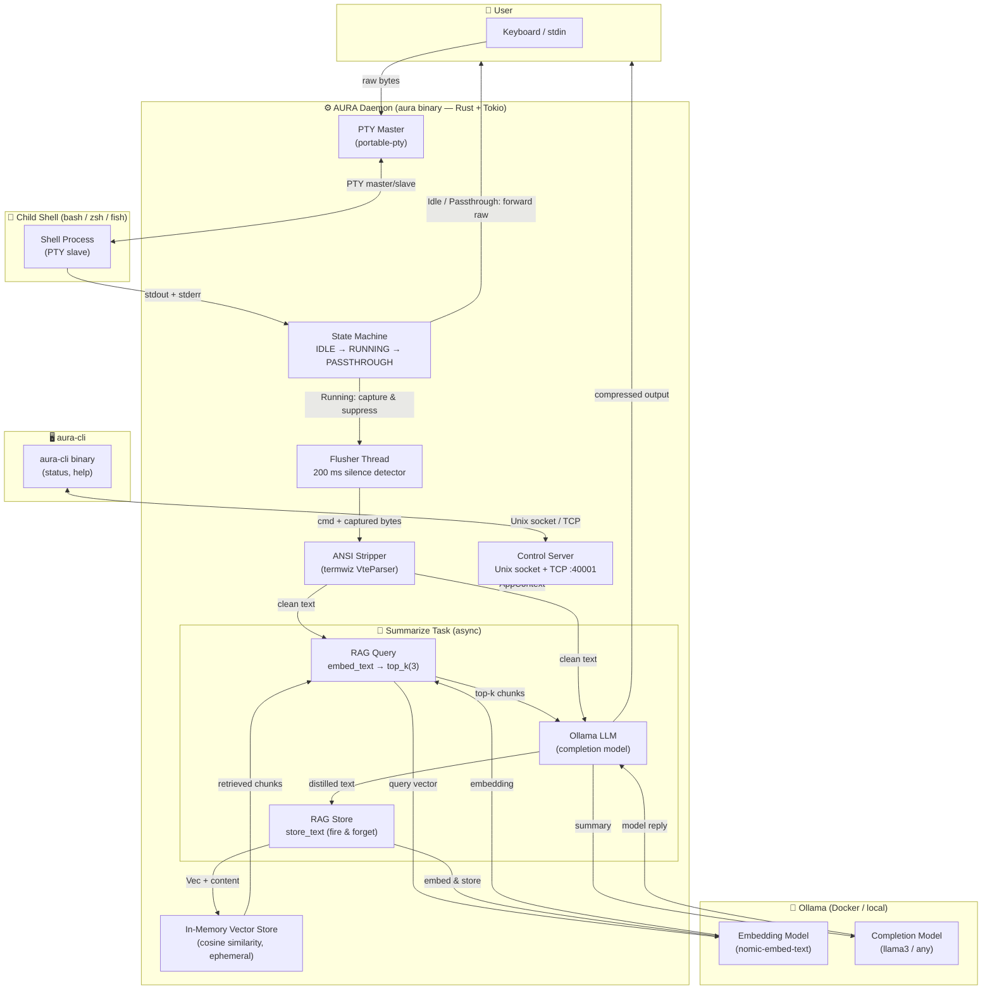

<div align="center">

# ✦ AURA

### _The AI-Native Terminal That Thinks Alongside You_

[](https://www.rust-lang.org/)
[](https://ollama.ai/)
[](LICENSE)

> **AURA replaces your terminal emulator with an AI agent that observes, understands, and compresses every command you run — building a living, queryable memory of your entire session in real time.**

</div>

---

## The Problem

Developers spend hours in the terminal. Each command produces output — build logs, error traces, network diagnostics, deployment statuses — that vanishes from working memory the moment it scrolls off screen. You copy-paste into ChatGPT. You re-run commands you ran twenty minutes ago. You lose context between sessions.

**This is a solved problem. You just haven't had the right tool.**

---

## What AURA Does

AURA wraps your existing shell (`bash`, `zsh`, `fish` — whatever you use) inside an intelligent PTY layer. It intercepts every command and its output, runs it through a local LLM, and gives you back a semantically compressed version — the signal, not the noise.

More importantly: it **remembers**. Every compressed output is embedded into an in-memory vector store. The next time you run a related command, AURA automatically retrieves the most relevant past context and injects it into the model's prompt — without you lifting a finger.

**Your terminal gains a persistent, growing memory that makes every subsequent command smarter.**

---

## Architecture



---

## Technical Design

### 1 · PTY Interception Layer

AURA opens a native PTY master/slave pair (`portable-pty`), spawns your real shell on the slave side, and sits in between. Three concurrent OS threads implement a lock-free state machine:

| State | Behaviour |
|-------|-----------|
| `IDLE` | PTY output forwarded verbatim to your terminal |
| `RUNNING` | Output captured and suppressed; display deferred |
| `PASSTHROUGH` | Full-screen apps (`vim`, `htop`, `less`) forwarded raw |

The transition `RUNNING → IDLE` is triggered by 200 ms of PTY silence — an empirically reliable signal that a command has finished.

### 2 · ANSI Normalization

Raw PTY output contains the full VT100/VT220 escape sequence set — cursor moves, colour codes, OSC titles, DCS strings. AURA uses `termwiz`'s `VteParser` (the same parser powering WezTerm) to strip all escape sequences and extract the semantic text. This clean text is what gets sent to the model and stored.

### 3 · LLM Summarization

The clean output is sent to a local Ollama instance with a carefully engineered prompt:

- **Role**: _"You are a compressor. Reduce terminal output for another LLM."_
- **Preserve**: error messages, stack traces, exit codes, unique identifiers (IPs, paths, UUIDs)
- **Discard**: progress bars, ANSI noise, repetitive in-progress logs
- **Safety**: `<BEGIN_OUTPUT>` / `<END_OUTPUT>` delimiters prevent prompt injection from malicious terminal content
- **Fallback**: if the summary is longer than the original, or empty, or times out — the original output is shown unchanged

### 4 · RAG Memory Engine

This is where AURA becomes genuinely novel.

**Query phase** (before LLM call): The clean output is embedded using a dedicated embedding model (`nomic-embed-text` via a direct HTTP call to `/api/embeddings` — no fragile SDK wrappers). The resulting vector is compared against all stored chunks via cosine similarity (`top_k(3)`). Matching chunks are injected into the prompt as `Previous Context`.

**Store phase** (after LLM call, fire-and-forget `tokio::spawn`): The distilled output is embedded and written into the `InMemoryStore` — an in-process `Vec<StoredChunk>` protected by a `tokio::RwLock`. This never delays your terminal.

The result: **each command you run makes every future command in the session smarter**. The store is ephemeral by design — it lives for the duration of your session, keeping memory footprint minimal and privacy concerns nonexistent.

### 5 · Control Plane

A lightweight control server binds to both a Unix-domain socket (`$XDG_RUNTIME_DIR/aura.sock`) and a TCP loopback listener (`127.0.0.1:40001`). The `aura-cli` binary connects to this channel for real-time introspection (`status`, `help`). The gRPC layer (`tonic` + `prost`) is plumbed for future agent-to-agent communication.

---

## Quickstart

### Prerequisites

- **Rust** ≥ 1.76 (`curl https://sh.rustup.rs | sh`)
- **Docker** (for Ollama) — or a local `ollama` binary

### 1 · Start Ollama + build

```bash
./scripts/aura.sh           # starts Docker-based Ollama, builds, runs aura
```

Or manually:

```bash
ollama pull llama3
ollama pull nomic-embed-text
cargo build --release --bins
./target/release/aura
```

### 2 · Use it

Just use your terminal. Commands with output longer than 250 bytes (configurable) are automatically summarized. The first few commands build the memory; from there you'll see context-aware summaries.

```bash
# In a separate terminal or within the aura session:
./target/release/aura-cli status
```

---

## Configuration

All settings are live-reloaded from environment variables — no restart required.

| Variable | Default | Description |
|----------|---------|-------------|
| `AURA_COMPLETION_MODEL` | `llama3` | Ollama model used for summarization |
| `AURA_EMBEDDING_MODEL` | `nomic-embed-text` | Ollama model used for RAG embeddings |
| `AURA_OLLAMA_BASE_URL` | `http://localhost:11434` | Ollama API endpoint |
| `AURA_SUMMARIZE_THRESHOLD` | `250` | Min output bytes before LLM is invoked |
| `AURA_SUMMARIZE_TIMEOUT_SECS` | `3000` | Summarization timeout (seconds) |
| `AURA_DISABLE_SUMMARY` | _(unset)_ | Set to `1` to disable summarization entirely |
| `AURA_DISABLE_RAG` | _(unset)_ | Set to `1` to disable embedding/vector store |
| `AURA_LOGGING` | _(unset)_ | Set to `1` to enable tracing (respects `RUST_LOG`) |
| `AURA_CONTROL_SOCKET` | `$XDG_RUNTIME_DIR/aura.sock` | Unix control socket path |
| `AURA_CONTROL_TCP` | `127.0.0.1:40001` | TCP control fallback address |

---

## Why This Matters

### For Developers

- **Zero workflow change.** Drop-in replacement for your terminal. Your shell, your aliases, your dotfiles — all untouched.
- **Local-first, private by design.** All inference runs on your machine via Ollama. Nothing leaves your network.
- **Any model, any size.** Switch from `llama3` to `deepseek-coder` to `qwen2.5` in one env var change. Quantized models work out of the box.

### For the AI Ecosystem

AURA represents a new primitive: **the AI-augmented shell session**. The terminal is the universal interface of software engineering. Every CI pipeline, every deployment, every debugging session flows through it. Instrumenting the terminal with a local reasoning layer — one that builds semantic memory across the session — creates a foundation for a class of developer agents that don't require cloud APIs, don't exfiltrate data, and don't break existing workflows.

This is the unsexy, invisible infrastructure layer that every "AI coding assistant" built on top of IDEs is missing. AURA operates at the OS process boundary, not the editor extension layer.

---

## Roadmap

- [ ] Persistent cross-session memory (SQLite / DuckDB vector extension)
- [ ] `aura export` — serialize session memory to structured JSON for downstream agents
- [ ] Semantic search across session history via `aura-cli search <query>`
- [ ] Agent hooks — trigger external actions on pattern match (e.g., auto-open issue on detected crash)
- [ ] Team memory sharing — broadcast session context over a local network
- [ ] Streaming summarization — display partial results as the LLM generates them
- [ ] Plugin API — register custom tools that the LLM can invoke mid-session

---

## Contributing

AURA is at the frontier of local AI tooling. If you're building in the AI developer tools space, working on LLM inference, or just love systems programming in Rust — open an issue or a PR. We're moving fast.

---

## License

MIT © Thimbleberry Systems

- `XDG_RUNTIME_DIR`: used to locate the default UDS path when present.

Examples

- Request status via the client:

```bash
./target/debug/aura-cli status
# or, if installed to PATH
aur a-cli status
```

- Quick debug using `socat` (UDS):

```bash
echo -n "status\n" | socat - UNIX-CONNECT:"${AURA_CONTROL_SOCKET:-/run/user/$(id -u)/aura.sock}"
```

Implementation notes

- Control server: `src/cli_server.rs` (UDS + TCP listener, simple one-line command protocol).
- Client: `src/cli_client.rs` (built as `aura-cli`).
- Status/diagnostics helpers: `src/tools/status.rs`.

Testing

```bash
cargo test
```

Contributing

Feel free to file issues or pull requests. Run `cargo test` and `cargo build --bins` before submitting changes.

License

MIT/Apache-2.0 (see repository root for exact licensing terms)

Ingestion (VT100 → embeddings → SQLite vector store)
---------------------------------------------------

- The daemon sanitizes PTY output (VT100 parsing via `termwiz`) and produces
	`SanitizedChunk` items containing `session_id`, `ts`, and `text`.
- Ingestion is enabled by default and configurable via environment variables
	and `config/aura.toml` entries documented in `src/cfg.rs`.
- Embeddings are produced using the `rig` providers (default: Ollama
	`nomic-embed-text`, 768 dims). The embedding provider and dims can be
	overridden via `AURA_EMBEDDING_MODEL` and `AURA_EMBEDDING_DIMS`.
- Storage uses `rig-sqlite` backed by the `sqlite-vec` extension. The SQLite
	file path is controlled by `AURA_SQLITE_PATH` (default `./aura.db`).

Files of interest:

- `src/ingest/mod.rs` — ingestion worker: batching, embedding, and storage.
- `src/cfg.rs` — configuration helpers and environment variable defaults.
- `Cargo.toml` — added `rig-sqlite`, `sqlite-vec`, and `tokio-rusqlite`.

Notes:

- A running Ollama server is required to use the default embedding provider.
- The code initializes `sqlite-vec` before opening the database so that the
	vector extension is available to the `rig-sqlite` store.

If you'd like, I can add a small integration test or a startup README snippet
that demonstrates ingest end-to-end (requires Ollama running).
