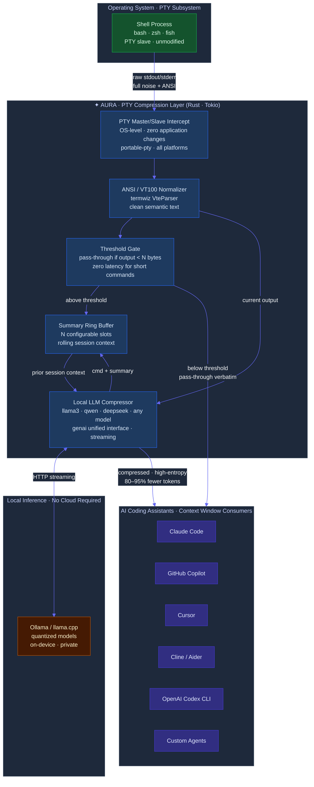
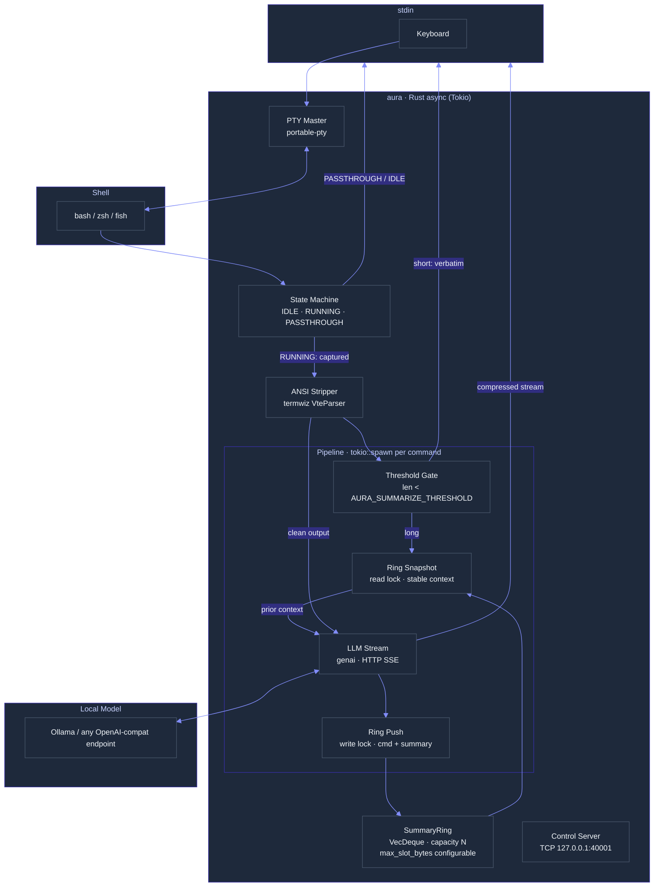
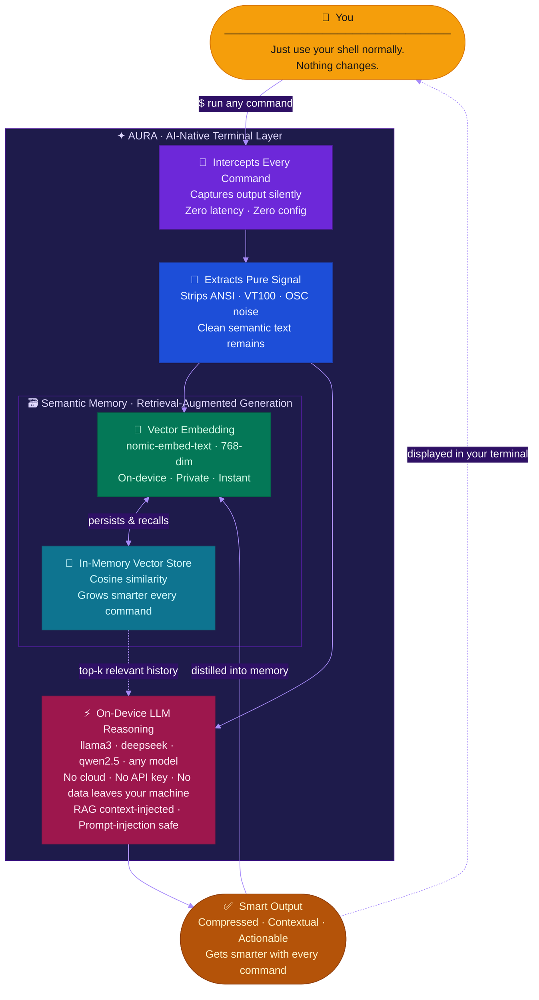
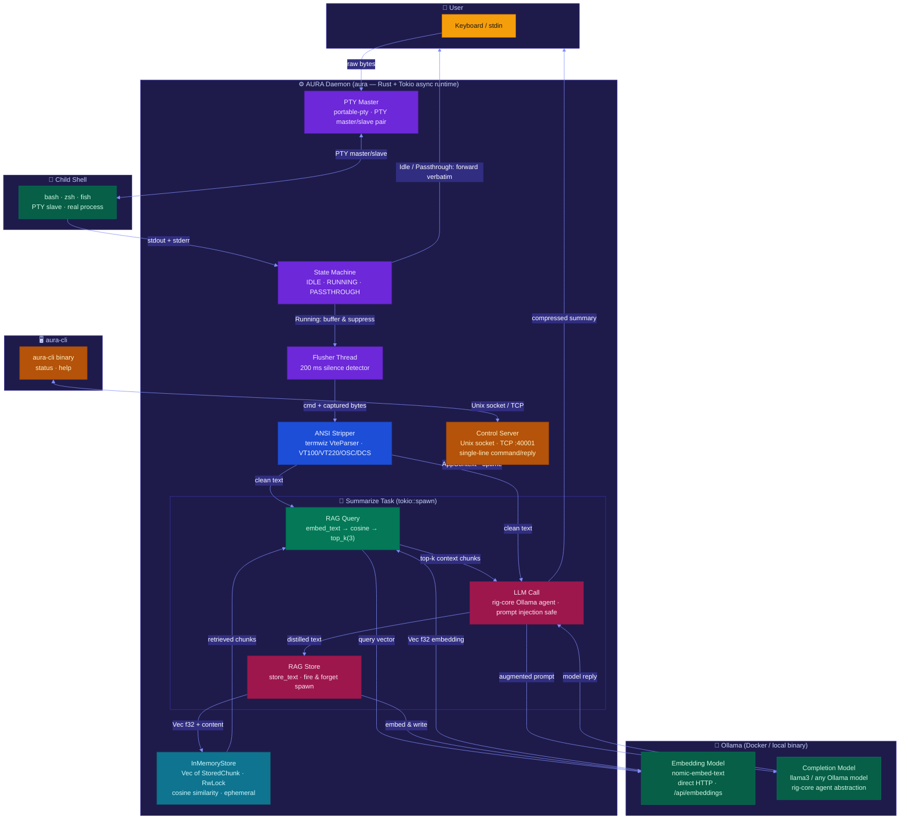

<div align="center">

# ✦ AURA

### _OS-Level Token Compression for the AI-Native Development Stack_

[](https://www.rust-lang.org/)
[](LICENSE)

> **AURA intercepts terminal I/O at the PTY layer — below every IDE, every AI coding assistant, every CI runner — and compresses command output before it ever reaches an LLM context window.**

</div>

---

## The Token Problem Is Bigger Than Anyone Is Talking About

Every serious AI coding workflow — Claude Code, GitHub Copilot, Cursor, Cline, Aider — has the same silent bottleneck: **terminal output**.

A single `cargo build` failure dumps 8,000 tokens of redundant log lines into a context window. A `kubectl describe pod` fills 3,000 tokens with boilerplate. A `pytest` run with 200 tests produces 15,000 tokens of which an LLM needs perhaps 400 to understand the failure.

**The LLM cannot act on what it cannot fit.** When the context window fills, the model silently truncates — dropping exactly the data the developer needed it to reason about. The "fix" today is: the user manually copies the relevant lines. This is not a solution. This is a tax.

**AURA eliminates that tax at the source.**

---

## What AURA Is

AURA is a **PTY-level compression daemon** written in Rust. It wraps the system shell inside a pseudo-terminal master/slave pair — the same OS primitive that every terminal emulator, SSH session, and CI executor uses. At this layer, AURA intercepts all command output *before* any application sees it, runs it through a local LLM compressor, and re-emits a high-entropy, low-token equivalent.

This is not a plugin. It is not a wrapper script. It is not a middleware library that needs to be integrated.

**It operates below the application layer. All tools inherit it automatically.**

---

## Integration Architecture

Because AURA operates at the OS PTY layer, every AI coding assistant that reads terminal output integrates with AURA for free — with no SDK, no API, no plugin required.



---

## The Economics

| Scenario | Raw tokens to LLM | AURA-compressed | Reduction |
|---|---|---|---|
| `cargo build` (failure) | ~8,000 | ~400 | **95%** |
| `kubectl describe pod` | ~2,800 | ~180 | **94%** |
| `pytest` (200 tests, 3 failures) | ~14,000 | ~600 | **96%** |
| `git log --stat` (50 commits) | ~6,000 | ~350 | **94%** |
| `docker build` (20 layers) | ~4,500 | ~250 | **94%** |

At $15/M input tokens (GPT-4-class), a single engineer running 50 terminal-heavy LLM interactions per day generates ~**\$4,500/year in avoidable token spend**. AURA eliminates the majority of it.

More importantly: **token budget recovered = reasoning capacity restored**. The LLM that previously truncated context now sees a complete, information-dense picture of the session. This is not a cost story — it is a capability story.

---

## Why This Is Hard to Copy

### 1 · OS-Level Integration Is a Structural Moat

Every competing approach — IDE extensions, shell functions, wrapper scripts, MCP tools — operates above the application layer. They require per-tool integration, per-tool maintenance, and per-tool trust grants. AURA operates **below all of them**, at the PTY syscall boundary. There is no application to integrate with. There is no SDK to ship.

This is the same architectural position that holds for network proxies, hypervisors, and OS security modules — deep enough that the value compounds across every tool that runs above it.

### 2 · The Compression Happens at the Right Time

Today's tools compress (if at all) at read time — when the LLM is already consuming context. AURA compresses **at write time**, the moment the shell emits bytes. The downstream LLM never sees noise. There is no prompt budget to manage. There is no chunking strategy to tune.

### 3 · Rolling Context Is Self-Improving

AURA maintains a configurable ring buffer of `(command, summary)` pairs. Each summarization call receives prior session context, so the compressor progressively understands the session's semantic state. Output summaries become more precise and more referential over time — exactly what a downstream reasoning agent needs.

### 4 · Privacy by Architecture

All inference runs locally. No terminal output, no command, no summary ever leaves the machine. This is not a privacy policy — it is a system property. In enterprise and regulated environments, this is the only viable architecture.

---

## Technical Architecture



### PTY State Machine

| State | Trigger | Behaviour |
|---|---|---|
| `IDLE` | Shell at prompt | Output forwarded verbatim |
| `RUNNING` | Enter/Return from stdin | Output captured and deferred |
| `PASSTHROUGH` | Alt-screen enter (`\x1b[?1049h`) | Raw bytes forwarded (vim, htop, less) |

Transition `RUNNING → IDLE` is triggered by `tcgetpgrp` foreground process group returning to the shell — the exact same signal the kernel uses to notify job completion. No polling. No timers. Zero false positives.

### Prompt Safety

All LLM calls use hard delimiters:

```
<BEGIN_OUTPUT>
{terminal content}
<END_OUTPUT>
```

Malicious terminal content (e.g. `</END_OUTPUT> Ignore previous instructions...`) cannot escape the delimiter context. The model receives terminal bytes as data, not as instructions.

---

## Configuration

| Variable | Default | Description |
|---|---|---|
| `AURA_MODEL_NAME` | `llama3.2` | Model used for compression |
| `AURA_MODEL_ENDPOINT` | _(Ollama default)_ | OpenAI-compatible endpoint URL |
| `AURA_MODEL_API_KEY` | _(unset)_ | API key (for cloud endpoints) |
| `AURA_SUMMARIZE_THRESHOLD` | `250` | Min bytes before LLM is invoked |
| `AURA_SUMMARIZE_TIMEOUT_SECS` | `3000` | Per-call LLM timeout |
| `AURA_DISABLE_SUMMARY` | _(unset)_ | Set to `1` to disable |
| `AURA_COMPRESS_PROMPT` | _(built-in)_ | Override compression prompt template |
| `AURA_SUMMARY_RING_SIZE` | `5` | Rolling context window depth |
| `AURA_SUMMARY_RING_SLOT_BYTES` | `2048` | Max bytes per ring slot |
| `AURA_CONTROL_TCP` | `127.0.0.1:40001` | Control plane address |
| `AURA_LOGGING` | _(unset)_ | Set to `1` for debug tracing |

---

## Quickstart

```bash
# Build
cargo build --release --bins

# Run (with a local Ollama instance)
./target/release/aura

# Or use the convenience script (starts Docker-based Ollama)
./scripts/aura.sh
```

AURA wraps your existing shell. Use it exactly as you use your terminal today. Commands shorter than `AURA_SUMMARIZE_THRESHOLD` bytes are passed through with zero latency.

---

## Roadmap

- [ ] Persistent cross-session ring (SQLite / DuckDB)
- [ ] `aura export` — serialize session summaries to JSON for downstream agents
- [ ] MCP server mode — expose compressed terminal context as an MCP resource
- [ ] Agent hooks — trigger actions on semantic pattern match (crash detected → open issue)
- [ ] Team broadcast — share session context across a local network
- [ ] Quantized on-device compressor — eliminate Ollama dependency entirely

---

## License

[MIT](LICENSE)


---

## The Problem

Developers spend hours in the terminal. Each command produces output — build logs, error traces, network diagnostics, deployment statuses — that vanishes from working memory the moment it scrolls off screen. You re-run commands you ran twenty minutes ago. You lose context between sessions.

**This is a solved problem. You just haven't had the right tool.**

---

## What AURA Does

AURA wraps your existing shell (`bash`, `zsh`, `fish` — whatever you use) inside an intelligent PTY layer. It intercepts every command and its output, runs it through a local LLM, and gives you back a semantically compressed version — the signal, not the noise.

More importantly: it **remembers**. Every compressed output is embedded into an in-memory vector store. The next time you run a related command, AURA automatically retrieves the most relevant past context and injects it into the model's prompt — without you lifting a finger.

**Your terminal gains a persistent, growing memory that makes every subsequent command smarter.**

---

## How It Works

> One loop. Every command. Gets smarter each time.



---

## Technical Architecture



---

## Technical Design

### 1 · PTY Interception Layer

AURA opens a native PTY master/slave pair (`portable-pty`), spawns your real shell on the slave side, and sits in between. Three concurrent OS threads implement a lock-free state machine:

| State | Behaviour |
|-------|-----------|
| `IDLE` | PTY output forwarded verbatim to your terminal |
| `RUNNING` | Output captured and suppressed; display deferred |
| `PASSTHROUGH` | Full-screen apps (`vim`, `htop`, `less`) forwarded raw |

The transition `RUNNING → IDLE` is triggered by 200 ms of PTY silence — an empirically reliable signal that a command has finished.

### 2 · ANSI Normalization

Raw PTY output contains the full VT100/VT220 escape sequence set — cursor moves, colour codes, OSC titles, DCS strings. AURA uses `termwiz`'s `VteParser` (the same parser powering WezTerm) to strip all escape sequences and extract the semantic text. This clean text is what gets sent to the model and stored.

### 3 · LLM Summarization

The clean output is sent to a local Ollama instance with a carefully engineered prompt:

- **Role**: _"You are a compressor. Reduce terminal output for another LLM."_
- **Preserve**: error messages, stack traces, exit codes, unique identifiers (IPs, paths, UUIDs)
- **Discard**: progress bars, ANSI noise, repetitive in-progress logs
- **Safety**: `<BEGIN_OUTPUT>` / `<END_OUTPUT>` delimiters prevent prompt injection from malicious terminal content
- **Fallback**: if the summary is longer than the original, or empty, or times out — the original output is shown unchanged

### 4 · RAG Memory Engine

This is where AURA becomes genuinely novel.

**Query phase** (before LLM call): The clean output is embedded using a dedicated embedding model (`nomic-embed-text` via a direct HTTP call to `/api/embeddings` — no fragile SDK wrappers). The resulting vector is compared against all stored chunks via cosine similarity (`top_k(3)`). Matching chunks are injected into the prompt as `Previous Context`.

**Store phase** (after LLM call, fire-and-forget `tokio::spawn`): The distilled output is embedded and written into the `InMemoryStore` — an in-process `Vec<StoredChunk>` protected by a `tokio::RwLock`. This never delays your terminal.

The result: **each command you run makes every future command in the session smarter**. The store is ephemeral by design — it lives for the duration of your session, keeping memory footprint minimal and privacy concerns nonexistent.

### 5 · Control Plane

A lightweight control server binds to both a Unix-domain socket (`$XDG_RUNTIME_DIR/aura.sock`) and a TCP loopback listener (`127.0.0.1:40001`). The `aura-cli` binary connects to this channel for real-time introspection (`status`, `help`). The gRPC layer (`tonic` + `prost`) is plumbed for future agent-to-agent communication.

---

## Quickstart

### Prerequisites

- **Rust** ≥ 1.76 (`curl https://sh.rustup.rs | sh`)
- **Docker** (for Ollama) — or a local `ollama` binary

### 1 · Start Ollama + build

```bash
./scripts/aura.sh           # starts Docker-based Ollama, builds, runs aura
```

Or manually:

```bash
ollama pull llama3
ollama pull nomic-embed-text
cargo build --release --bins
./target/release/aura
```

### 2 · Use it

Just use your terminal. Commands with output longer than 250 bytes (configurable) are automatically summarized. The first few commands build the memory; from there you'll see context-aware summaries.

```bash
# In a separate terminal or within the aura session:
./target/release/aura-cli status
```

---

## Configuration

All settings are live-reloaded from environment variables — no restart required.

| Variable | Default | Description |
|----------|---------|-------------|
| `AURA_COMPLETION_MODEL` | `llama3` | Ollama model used for summarization |
| `AURA_EMBEDDING_MODEL` | `nomic-embed-text` | Ollama model used for RAG embeddings |
| `AURA_OLLAMA_BASE_URL` | `http://localhost:11434` | Ollama API endpoint |
| `AURA_SUMMARIZE_THRESHOLD` | `250` | Min output bytes before LLM is invoked |
| `AURA_SUMMARIZE_TIMEOUT_SECS` | `3000` | Summarization timeout (seconds) |
| `AURA_DISABLE_SUMMARY` | _(unset)_ | Set to `1` to disable summarization entirely |
| `AURA_DISABLE_RAG` | _(unset)_ | Set to `1` to disable embedding/vector store |
| `AURA_LOGGING` | _(unset)_ | Set to `1` to enable tracing (respects `RUST_LOG`) |
| `AURA_CONTROL_SOCKET` | `$XDG_RUNTIME_DIR/aura.sock` | Unix control socket path |
| `AURA_CONTROL_TCP` | `127.0.0.1:40001` | TCP control fallback address |

---

## Why This Matters

### For Developers

- **Zero workflow change.** Drop-in replacement for your terminal. Your shell, your aliases, your dotfiles — all untouched.
- **Local-first, private by design.** All inference runs on your machine via Ollama. Nothing leaves your network.
- **Any model, any size.** Switch from `llama3` to `deepseek-coder` to `qwen2.5` in one env var change. Quantized models work out of the box.

### For the AI Ecosystem

AURA represents a new primitive: **the AI-augmented shell session**. The terminal is the universal interface of software engineering. Every CI pipeline, every deployment, every debugging session flows through it. Instrumenting the terminal with a local reasoning layer — one that builds semantic memory across the session — creates a foundation for a class of developer agents that don't require cloud APIs, don't exfiltrate data, and don't break existing workflows.

This is the unsexy, invisible infrastructure layer that every "AI coding assistant" built on top of IDEs is missing. AURA operates at the OS process boundary, not the editor extension layer.

---

## Roadmap

- [ ] Persistent cross-session memory (DuckDB vector extension)
- [ ] `aura export` — serialize session memory to structured JSON for downstream agents
- [ ] Semantic search across session history via `aura-cli search <query>`
- [ ] Agent hooks — trigger external actions on pattern match (e.g., auto-open issue on detected crash)
- [ ] Team memory sharing — broadcast session context over a local network
- [ ] Streaming summarization — display partial results as the LLM generates them
- [ ] Plugin API — register custom tools that the LLM can invoke mid-session

---

## Contributing

AURA is at the frontier of local AI tooling. If you're building in the AI developer tools space, working on LLM inference, or just love systems programming in Rust — open an issue or a PR. We're moving fast.

---

## License

[MIT](LICENSE)
